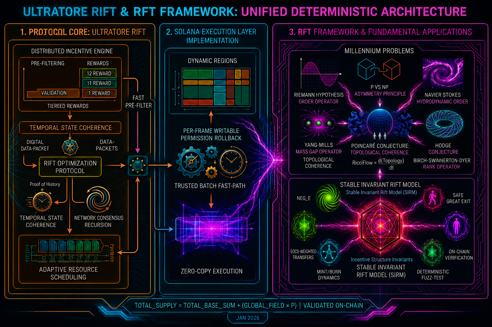
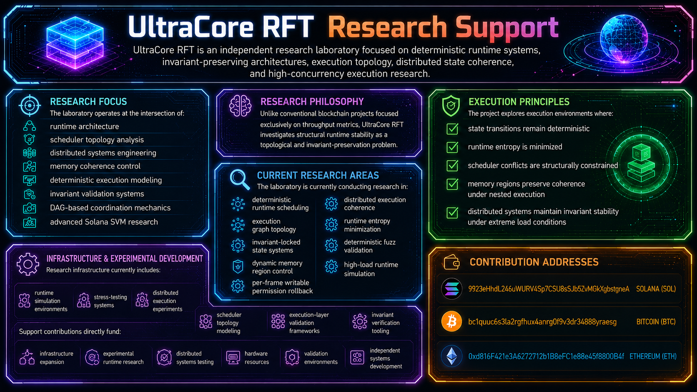

# UltraCore RFT
## Unified Deterministic Architecture for Runtime Stability

<p align="center">
  
</p>

---

# Overview

UltraCore RFT (Reality Fractal Theory) is a deterministic systems architecture focused on runtime stability, invariant preservation, execution topology, and high-concurrency distributed computation.

The project explores how complex execution environments can maintain structural coherence under extreme load conditions through deterministic scheduling, memory topology control, invariant-locked execution, and anti-entropy runtime coordination.

Unlike conventional distributed systems that rely heavily on probabilistic conflict resolution and reactive execution models, RFT treats execution as a topological coordination problem.

Inside RFT:

- schedulers become topology coordinators,
- runtime state becomes an evolving manifold,
- memory regions become coherence fields,
- execution graphs become deterministic structures,
- and validation becomes invariant verification.

---

# Core Principle

The central principle of UltraCore RFT is:

> Stable execution emerges from invariant preservation across time, memory, and state transitions.

The framework attempts to minimize:

- entropy amplification,
- scheduler turbulence,
- execution fragmentation,
- state divergence,
- writable permission leakage,
- and recursive instability under nested execution.

---

# Stable Invariant Rift Model (SIRM)

At the center of the architecture lies:

## SIRM — Stable Invariant Rift Model

SIRM defines a deterministic invariant-preservation framework governing:

- runtime coherence,
- execution stability,
- scheduler synchronization,
- distributed validation,
- and economic state conservation.

The primary invariant structure is represented as:

```
TOTAL_SUPPLY = TOTAL_BASE_SUM + (GLOBAL_FIELD × P)
```
This invariant acts as a persistent conservation constraint across execution cycles.
Architecture Layers
1. Protocol Core
The protocol layer governs:
temporal state coherence,
adaptive scheduling,
deterministic packet prioritization,
distributed incentive balancing,
and pre-runtime execution filtering.
The system introduces topology-aware pre-filtering capable of reducing execution instability before transaction dispatch.
2. Solana Execution Layer
The Solana runtime subsystem focuses on:
dynamic memory region management,
per-frame writable permission rollback,
deterministic batch execution,
Trusted Batch Fast-Path processing,
and zero-copy execution mechanics.
The objective is to preserve runtime coherence while reducing scheduler overhead and lock contention.
3. RFT Mathematical Framework
The mathematical layer introduces structural runtime interpretations of several topological and analytical operators.
These include:
P vs NP asymmetry,
Riemann state-spacing control,
Navier-Stokes runtime smoothness,
Yang-Mills invariant floors,
Hodge materialization structures,
Birch–Swinnerton-Dyer relational identity,
and Poincaré topology smoothing.
Inside RFT these operators are treated not as abstract mathematics, but as deterministic runtime coordination mechanisms.
Current Research Areas
UltraCore RFT is currently focused on:
deterministic runtime scheduling,
execution graph topology,
memory coherence systems,
distributed execution stability,
runtime entropy minimization,
invariant-preserving architectures,
DAG-based coordination,
deterministic validation systems,
and high-load runtime simulation.
Repository Structure
Main Documents
RFT Overview
Core architectural overview of UltraCore RFT.
RFT Mathematical Foundations
Structural interpretation of 7 Millennium Operators governing deterministic runtime stability.
RFT Development Strategy & Roadmap
Parallel development architecture of the RFT ecosystem.
Long-Term Objective
The long-term objective of UltraCore RFT is the development of:
fully deterministic runtime environments,
invariant-preserving distributed systems,
topology-aware execution architectures,
anti-entropy coordination frameworks,
and stable high-concurrency computational ecosystems.
Research Support
<p align="center">  </p>
UltraCore RFT operates as an independent research laboratory.
Support contributions directly fund:
runtime research,
infrastructure expansion,
distributed systems testing,
experimental simulations,
hardware resources,
validation environments,
and independent systems development.


# Contribution Addresses

## Solana (SOL)

```
9923eHhdL246uWURV4Sp7CSU8sSJb5ZvMGkXgbstgneA
```

## Bitcoin (BTC)

```
bc1quuc6s3la2rgfhux4anrg0f9v3dr34888yraesg
```

## Ethereum (ETH)

```
0xd816F421e3A6272712b1B8eFC1e88e45f8800B4f
```

---

# Open Collaboration

The project remains open to collaboration with:

- runtime engineers,
- distributed systems researchers,
- Solana infrastructure developers,
- mathematicians,
- physicists,
- systems architects,
- and complex systems researchers.

UltraCore RFT evolves through:

- iterative implementation,
- empirical validation,
- runtime experimentation,
- deterministic systems research,
- and continuous architectural refinement.

---
