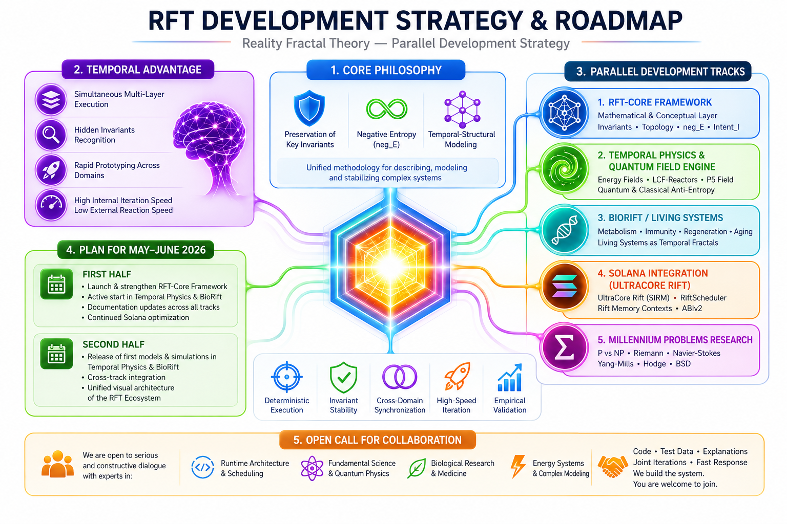

# RFT Development Strategy & Roadmap

  

## Reality Fractal Theory — Parallel Development Architecture

UltraCore RFT is evolving into a multi-domain deterministic systems framework focused on invariant preservation, temporal topology modeling, and anti-entropy execution architectures.

The purpose of this document is to outline the strategic development directions of the RFT ecosystem and explain how multiple research tracks are unified through the Stable Invariant Rift Model (SIRM).

---

# 1. Core Philosophy

Reality Fractal Theory (RFT) treats mathematics, code, physics, economics, distributed systems, and biological processes as manifestations of a single evolving temporal topology.

Within this framework:

- execution becomes topology coordination,
- invariants become structural anchors of stability,
- entropy becomes a measurable destabilization force,
- and deterministic architectures emerge through controlled state transitions.

The central stabilizing mechanism is:

## SIRM — Stable Invariant Rift Model

SIRM defines a deterministic invariant-preservation architecture capable of maintaining coherence across:

- runtime execution,
- memory regions,
- scheduler topology,
- economic state transitions,
- and distributed validation systems.

The primary objective is not maximum throughput alone, but long-term structural stability under extreme concurrency and recursive complexity.

---

# 2. Temporal Advantage

RFT development operates through parallel conceptual synchronization across multiple domains simultaneously.

This creates a natural asymmetry between:

- internal iteration velocity,
- and external institutional reaction speed.

The framework is designed around:

- rapid invariant discovery,
- high-speed conceptual recursion,
- deterministic iteration loops,
- and continuous cross-domain synchronization.

Engineering discipline remains grounded in:

- empirical validation,
- runtime testing,
- deterministic fuzzing,
- and measurable execution behavior.

---

# 3. Parallel Development Tracks

## RFT-Core Framework

The mathematical and conceptual foundation layer.

Research areas include:

- invariant theory,
- temporal topology,
- neg_E dynamics,
- structural coherence systems,
- and deterministic state-space modeling.

---

## Temporal Physics & Quantum Field Engine

Research focused on anti-entropy field behavior and temporal-structural physics models.

Current directions:

- energy field modeling,
- LCF-reactor concepts,
- informational field structures,
- anti-entropy simulation,
- and field stabilization mechanics.

---

## BioRift / Living Systems

Application of RFT principles to biological systems.

Research areas:

- metabolic invariants,
- regeneration dynamics,
- immunity stability,
- aging topology,
- and temporal-fractal biological structures.

---

## Solana Integration — UltraCore Rift

Applied implementation layer for deterministic blockchain runtime systems.

Current components:

- UltraCore Rift (SIRM economic layer),
- RiftScheduler,
- Rift Memory Contexts,
- ABIv2 execution improvements,
- per-frame rollback protection,
- and deterministic execution pathways.

Primary objective:

Reduce scheduler entropy and execution instability while preserving invariant coherence under high contention.

---

## Millennium Problems Research

RFT continues structured exploration of:

- P vs NP,
- Riemann Hypothesis,
- Navier-Stokes,
- Yang-Mills,
- Hodge Conjecture,
- and Birch–Swinnerton-Dyer.

Inside RFT these problems are interpreted as structural operators governing stability, ordering, recursion, and coherence across complex systems.

---

# 4. Development Plan

## Current Phase

- Expansion of RFT-Core architecture
- Runtime stabilization research
- Solana execution optimization
- Cross-domain synchronization
- Documentation and visualization systems
- High-load deterministic validation

---

## Next Phase

- Unified ecosystem architecture
- Physics simulation models
- BioRift experimental structures
- Advanced scheduler research
- Runtime invariant verification systems
- Parallel domain integration

---

# 5. Open Collaboration

The project remains open to constructive collaboration with researchers, engineers, runtime developers, physicists, mathematicians, and systems architects.

Particularly relevant areas include:

- Solana runtime architecture,
- scheduling systems,
- distributed memory models,
- deterministic execution systems,
- topology-based computation,
- anti-entropy systems,
- complex systems research,
- and biological modeling.

The ecosystem is being built iteratively through practical implementation, empirical validation, and continuous architectural refinement.
