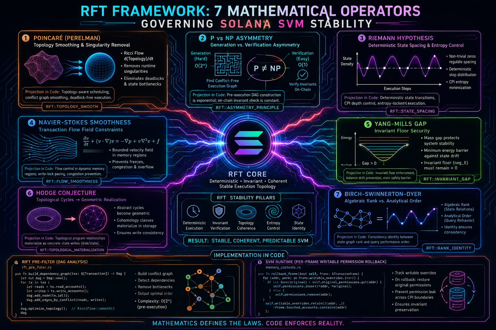

# RFT Mathematical Foundations

  

## 7 Millennium Operators Governing Deterministic Runtime Stability

UltraCore RFT introduces a deterministic execution framework for distributed runtime systems operating under high concurrency conditions.

Unlike probabilistic execution architectures that rely on reactive conflict resolution, RFT models execution as a topological coordination process where runtime stability emerges from invariant preservation across memory, state transitions, and scheduler topology.

The purpose of this document is to explain how seven mathematical operators are projected into practical Solana runtime mechanics, memory topology control, deterministic scheduling, and execution coherence systems.

The operators described below are not treated as purely abstract mathematical entities.

Inside RFT they become structural runtime metaphors governing:

- scheduler coordination,
- execution topology,
- invariant preservation,
- memory coherence,
- CPI entropy control,
- and deterministic state evolution.

---

# Runtime Core

At the center of the architecture lies the Solana SVM Runtime operating as a deterministic execution substrate coordinated by RFT topology logic.

The runtime environment is treated as a continuously evolving state manifold where every transaction modifies execution geometry.

The primary objective is to preserve coherent state evolution under extreme parallelism without introducing entropy amplification or execution instability.

---

# 1. P vs NP Asymmetry

## Scheduling Path Generation vs Invariant Verification

The P vs NP operator models the asymmetry between:

- constructing a conflict-free execution topology,
- and verifying deterministic invariants after execution.

In practical Solana runtime conditions:

- generating optimal dependency graphs may approach exponential complexity,
- while invariant verification can remain near constant-time.

RFT leverages this asymmetry by separating:

1. expensive pre-execution topology construction,
2. lightweight runtime invariant verification.

This creates the foundation for:

- Trusted Batch Fast-Path execution,
- deterministic DAG routing,
- scheduler pre-filtering,
- and low-overhead runtime validation.

### Runtime Projection

RFT introduces:

- DAG dependency pre-analysis,
- transaction topology classification,
- conflict-domain separation,
- and invariant-locked execution batches.

This allows execution to bypass repeated reactive lock contention checks during runtime.

---

# 2. Poincaré Conjecture

## State Manifold Smoothing

The Poincaré operator governs topological coherence inside execution state-space.

In distributed runtimes, transaction contention creates singularities:

- deadlocks,
- cyclic dependencies,
- scheduler bottlenecks,
- and execution fragmentation.

RFT interprets Ricci Flow as a runtime smoothing mechanism.

The objective is to continuously reduce topological irregularities until the execution manifold converges into a stable coherent structure.

### Runtime Projection

This operator influences:

- scheduler graph simplification,
- execution path stabilization,
- dependency manifold flattening,
- and deterministic queue restructuring.

Within UltraCore RFT:

RicciFlow → Stable Execution Topology

The runtime continuously attempts to eliminate unstable execution curvature before transaction dispatch.

---

# 3. Riemann Hypothesis

## Deterministic State Spacing

The Riemann operator governs ordered state progression and entropy control.

Nested CPI execution introduces high-frequency state perturbations capable of destabilizing runtime determinism.

RFT models these perturbations as entropy waves propagating through execution space.

The objective is to maintain predictable state spacing between execution transitions.

### Runtime Projection

This operator controls:

- CPI entropy regulation,
- deterministic state intervals,
- execution oscillation damping,
- and predictable runtime propagation.

The runtime attempts to prevent chaotic state divergence under recursive execution chains.

---

# 4. Navier-Stokes Smoothness

## Dynamic Memory Region Hydrodynamics

The Navier-Stokes operator governs transaction flow stability inside dynamic memory regions.

Under high concurrency:

- writable account regions,
- stack frames,
- and execution buffers

behave similarly to turbulent hydrodynamic systems.

Unbounded execution velocity may produce:

- memory freezes,
- region starvation,
- scheduler turbulence,
- and execution collapse.

### Runtime Projection

RFT introduces bounded execution velocity constraints across memory topology.

This includes:

- writable region stabilization,
- bounded CPI propagation,
- dynamic region flow regulation,
- and freeze-prevention controls.

The objective is to preserve smooth runtime flow under heavy execution pressure.

---

# 5. Yang-Mills Gap

## Invariant Floor Security

The Yang-Mills operator defines the minimum invariant energy barrier required for runtime stability.

In distributed economic systems, unconstrained execution may introduce balance drift, invalid state transitions, or coherence collapse.

RFT introduces an invariant floor:

StableGap_m > 0

This acts as a permanent execution-energy threshold below which runtime coherence cannot collapse.

### Runtime Projection

This operator governs:

- invariant-locked balance systems,
- economic state preservation,
- anti-drift execution logic,
- and deterministic security floors.

The runtime continuously verifies that execution remains above the minimum coherence threshold.

---

# 6. Hodge Conjecture

## Topological Materialization

The Hodge operator governs the transformation of abstract execution intent into physical runtime state.

Inside distributed runtimes:

- intent,
- transaction topology,
- and execution graphs

must eventually materialize into persistent state structures.

RFT interprets this process as geometric materialization.

### Runtime Projection

This operator influences:

- state-write topology,
- disk persistence geometry,
- account-write coordination,
- and structured execution realization.

Abstract runtime relationships become concrete storage topology through deterministic execution mapping.

---

# 7. Birch-Swinnerton-Dyer Conjecture

## Algebraic Rank Identity

The BSD operator governs the relationship between:

- state graph connectivity,
- and analytical execution behavior.

Inside RFT:

execution performance is treated as a function of topological relational rank.

The richer the deterministic dependency structure, the more predictable and analyzable execution becomes.

### Runtime Projection

This operator affects:

- query-performance identity,
- execution graph ranking,
- scheduler relational analysis,
- and runtime coherence metrics.

The runtime attempts to maintain analytical consistency between execution topology and observable performance behavior.

---

# Rift Pre-Filter Runtime

One of the primary runtime subsystems inside UltraCore RFT is the Rift Pre-Filter.

This subsystem performs:

- DAG dependency analysis,
- conflict pre-classification,
- topology-aware scheduling,
- and deterministic batch segmentation.

The purpose of the pre-filter is to eliminate unstable execution paths before entering the Solana runtime scheduler.

This reduces:

- lock contention,
- entropy amplification,
- runtime turbulence,
- and scheduler fragmentation.

The system effectively transforms reactive execution into predictive topology coordination.

---

# Per-Frame Writable Permission Rollback

UltraCore RFT extends runtime stability through deterministic memory rollback control.

The mechanism is implemented through:

Per-Frame Writable Permission Rollback

inside the runtime memory topology subsystem.

The objective is to isolate writable permission mutations inside local execution frames.

If a nested CPI call attempts to violate execution topology or introduce invalid writable propagation:

- the local frame is reverted,
- permissions are rolled back,
- and global execution coherence is preserved.

### Runtime Effects

This mechanism prevents:

- memory permission leakage,
- recursive state corruption,
- invalid writable escalation,
- and unstable CPI topology drift.

The system effectively creates localized execution containment boundaries.

---

# Stable Invariant Rift Model (SIRM)

At the center of the architecture lies SIRM:

Stable Invariant Rift Model

SIRM defines the deterministic invariant structure governing runtime coherence.

The primary conservation constraint is represented as:

TOTAL_SUPPLY = TOTAL_BASE_SUM + (GLOBAL_FIELD × P)

This invariant acts as a persistent topological conservation law across execution cycles.

The runtime continuously validates:

- balance coherence,
- state conservation,
- execution topology integrity,
- and deterministic invariant stability.

---

# Conclusion

UltraCore RFT proposes a deterministic execution interpretation for distributed runtime systems.

Instead of treating runtime execution as probabilistic transaction processing, RFT models execution as topological state coordination governed by invariant-preserving operators.

The framework combines:

- scheduler topology analysis,
- memory coherence control,
- deterministic runtime stabilization,
- and invariant-preserving execution mechanics

into a unified distributed systems architecture.

The long-term objective is the construction of fully deterministic runtime environments capable of operating under extreme concurrency without structural instability.
